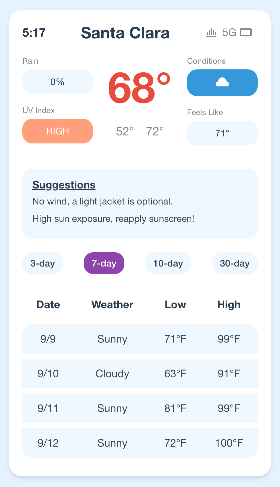
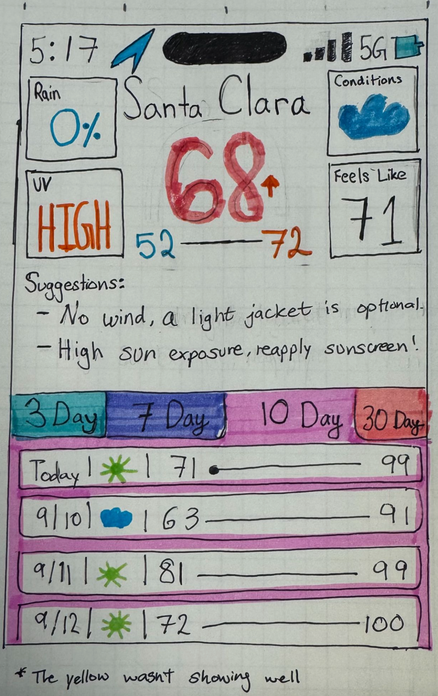

# CIS 4120 Assignment 1

Creating a frontend only weather app using Vite + React.

## Getting Started

1. Clone the repository
2. Run `npm install`
3. Run `npm run dev`

## React + Vite Mockup

HTML/CSS webapp using React + Vite

## Initial Concept

"High-fidelity Prototype"

